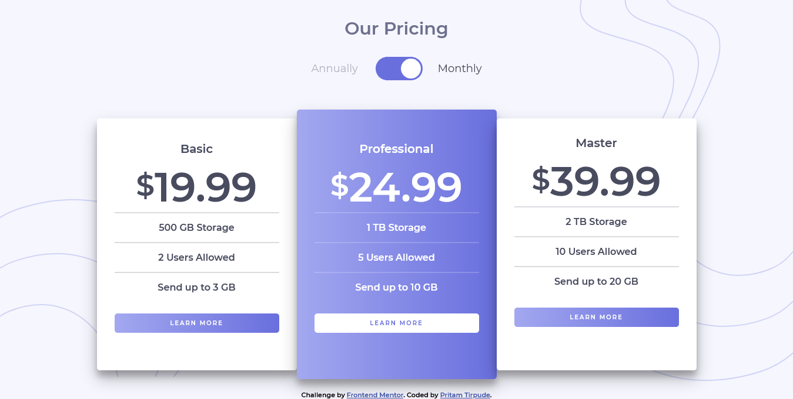

# Frontend Mentor - Pricing component with toggle

## Welcome! 👋

Thanks for checking out this front-end coding challenge.

[Frontend Mentor](https://www.frontendmentor.io) challenges help you improve your coding skills by building realistic projects.

**To do this challenge, you need a basic understanding of HTML, CSS and JavaScript.**

- [Overview](#overview)
  - [The challenge](#the-challenge)
  - [ Solution Screenshot](#screenshot)
  - [Links](#links)
- [My process](#my-process)
  - [Built with](#built-with)
  - [Useful resources](#useful-resources)
- [Author](#author)

## Overview

### The challenge

Users should be able to:

- View the optimal layout for the site depending on their device's screen size
- See hover states for all interactive elements on the page

### Screenshot

### Links

- Solution URL: [PRicing Component Toggle Master Solution](https://www.frontendmentor.io/challenges/pricing-component-with-toggle-8vPwRMIC/hub/html-css-sass-javascript-eyR86euZD)
- Live Site URL: [Live Site](https://pricing-component-master.netlify.app/)

## My process

### Built with

- Semantic HTML5 markup
- Sass (Syntactically awesome stylesheets)
- CSS custom properties
- Flexbox
- CSS Grid
- Mobile-first workflow

### Useful resources

-[CSS Grid Detail](https://css-tricks.com/snippets/css/complete-guide-grid/).
Please checkout the link to understand `Grid` better in full depth, very nicely elucidated by
Chris House.

-[CSS Flexbox Detail](https://css-tricks.com/snippets/css/a-guide-to-flexbox/).
Please checkout the link to understand `Flexbox` better in full depth, very nicely elucidated by
Chris Coyier.

## Author

- Frontend Mentor - [@Pritam-Tirpude](https://www.frontendmentor.io/profile/Pritam-Tirpude)
- Twitter - [@ptirpude1991](https://twitter.com/ptirpude1991)
